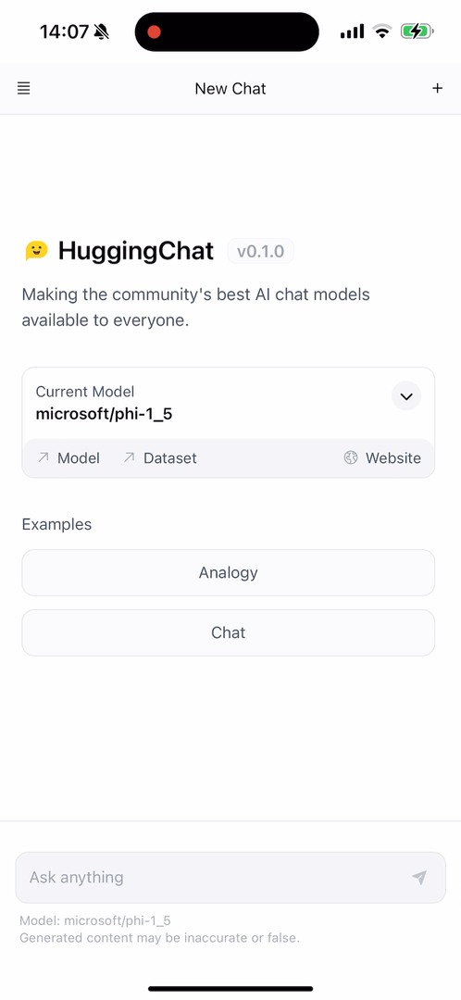

# hf-chat

`hf-chat` leverages [`huggingface/chat-ui`](https://github.com/huggingface/chat-ui) and [`huggingface/candle`](https://github.com/huggingface/candle) to create native and efficient chat apps for macOS and iOS. It uses [tauri](https://tauri.app) as the cross-platform middleware.

This is Microsoft Phi 1.5, unquantized, running locally on iPhone 15 Pro Max using Metal Performance Shaders (MPS) for acceleration:



## Build for iOS

0. Please, make sure you have Xcode installed with support for iOS development.

1. Install dependencies and the `cargo tauri` CLI.

```bash
$ pnpm install
$ cargo install tauri-cli --version=2.0.0-alpha.20
```

2. Change the app identifier and development team in `src-tauri/tauri.conf.json`. These are the default values that you'll need to replace:

```json
      "identifier": "co.huggingface.hfchat",
      "iOS": {
          "developmentTeam": "2EADP68M95"
      },
```

You can create an app identifier from Apple's developer site [visiting this link](https://developer.apple.com/account/resources/identifiers/list). To find your development team ID, select ["Membership details"](https://developer.apple.com/account#MembershipDetailsCard) after you log in to the developer site.

3. Generate the Xcode project files.

```bash
$ cargo tauri ios init
```

This will place the auto-generated files in `src-tauri/gen/`.

4. Run on device or a simulator. If you have an iPhone attached, it should be automatically detected. Otherwise, you'll be shown a menu to select an iOS simulator among the ones installed in your system.

```bash
cargo tauri ios dev
```

5. To generate an IPA archive suitable for deployment, replace the last command with:

```bash
cargo tauri ios build
```

